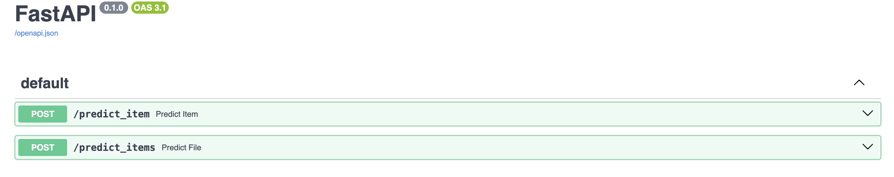
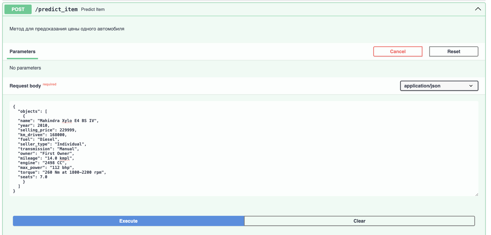
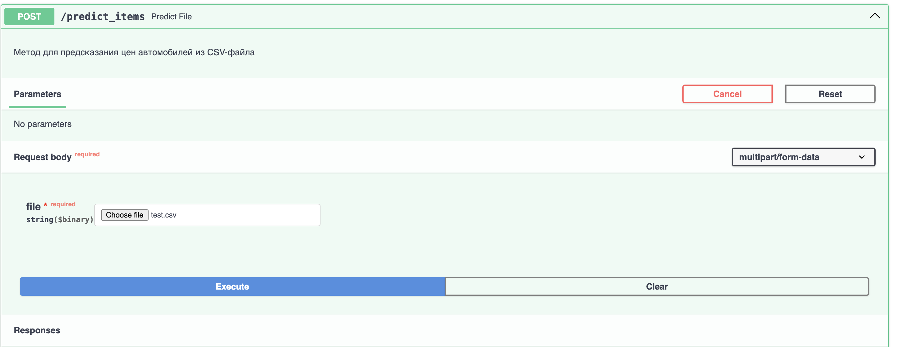
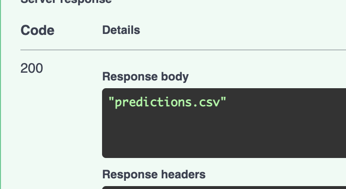
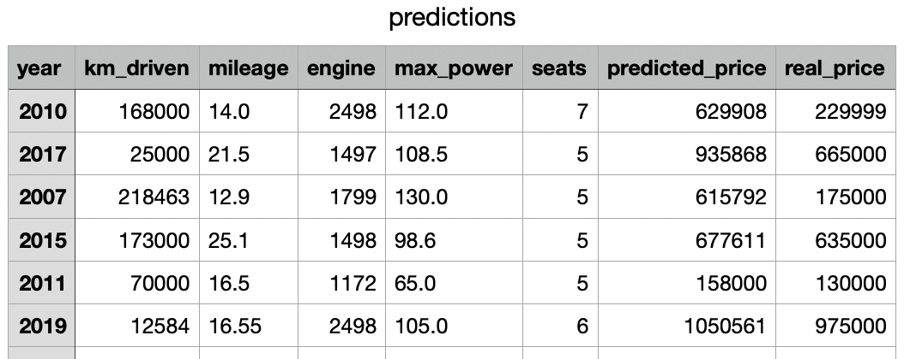

# ml_service_hw1
ДЗ 1 по ml

### Структура

* ``AI_HW1_Regression_with_inference_base.ipynb``- ноутбук со всеми проведёнными вами экспериментами
* ``data_report.html`` - сохраненный дашборд в формате html
* ``.py``- файл с реализацией сервиса
* ``model_scaler.pickle``- файл с сохранёнными весами модели, коэффициентами скейлинга и прочими числовыми значениями, которые могут понадобиться для инференса
* ``test.csv`` - Файл с данными для тестирования
* ``requirements.txt`` - Файл с зависимостями
* ``report.md``-файл с выводами про проделанной вами работе:
    * что было сделано
    * с какими результатами
    * что дало наибольший буст в качестве
    * что сделать не вышло и почему (это нормально, даже хорошо😀)

### Примеры работы сервиса fastapi

- метод post `predict_item`, который получает на вход один объект описанного класса и возвращает предсказание цены

Пример запроса predict_item:

Пример ответа predict_item:

- метод post `predict_items`, который получает на вход csv файл заданого формата, сохраняет файл predictions.csv и возвращает его название. В файле добавлена колонка с предсказанием для каждой записи

Пример запроса predict_items:

Пример ответа predict_item:

Пример итогового csv:

#### Видео демонстрация работы
[Пример работы сервиса](images/demo_ml_fastapi.mov)